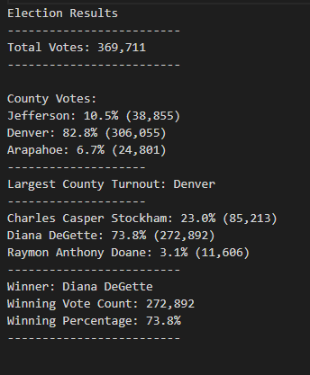

# Election_Analysis
## Overview of Election Audit
The purpose of this project is to help Seth and Tom analyze the results of the recent election. Seth and Tom have been asked by the election commission to perform an audit of the results to provide clarity of the outcome. We helped Seth and Tom determine the winner and understand voter turnout by county.
## Election-Audit Results

- There were 369,711 votes cast in the election.
- Denver had the highest percentage of voters (306,055 votes, 82.8%), followed by Jefferson (38,855 votes, 10.5%), and then lastly, Arapahoe (11,606 votes, 6.7%).
- Denver's 306,055 votes cast was by far the largest of all counties.
- Diane Degette had 73.8% of the vote and 272,892 votes. Charles Casper Stockham had 23% of the vote and 85,213 votes. Raymon Anthony Doane has 3.1% of the vote and 11,606 votes.
- Diane Degette won the election with 73.8% of the vote and 272,892 votes.
# Election-Audit Summary
The python script written for this audit can be very useful for future election audits. It is set up in a way where the major changes that would be needed would only be to change the csv file referenced in it and the .txt file that it outputs to. This would be an efficient way to quickly and accurately audit future elections.
